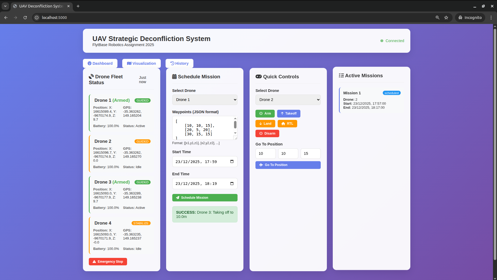
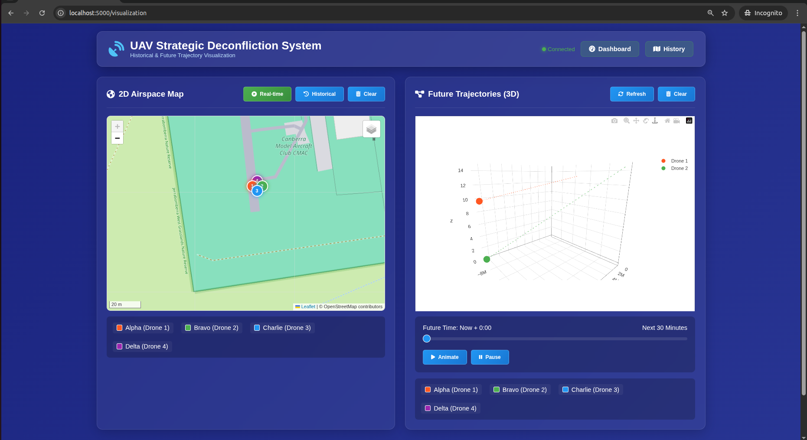
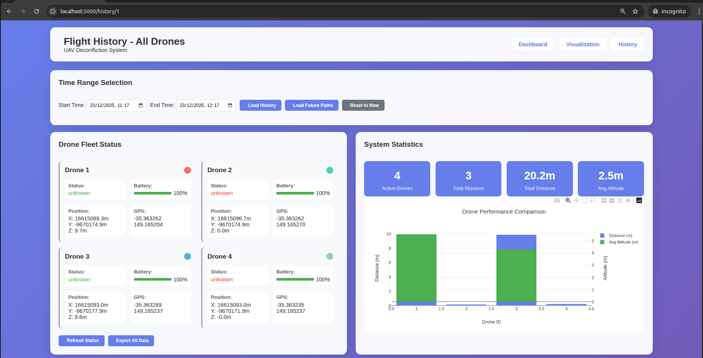
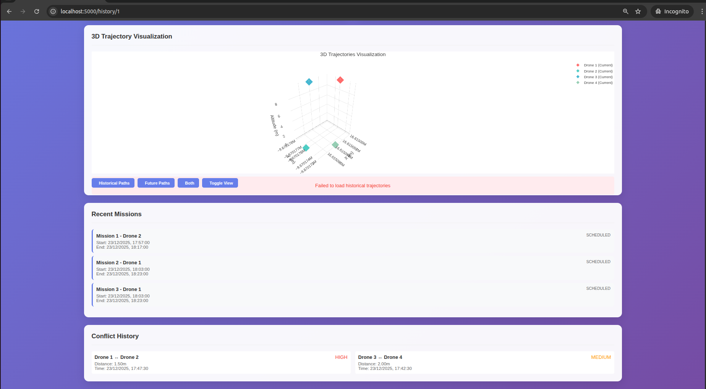
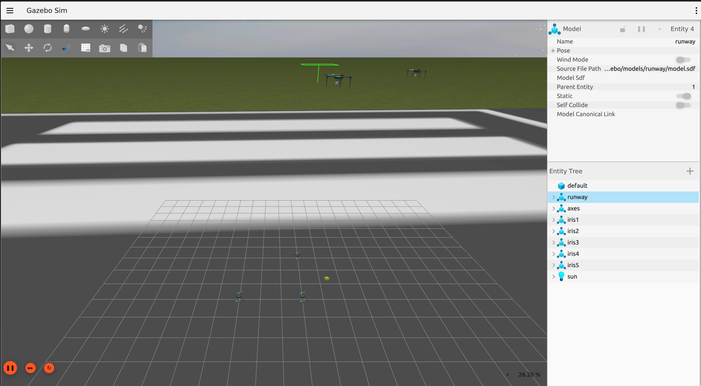
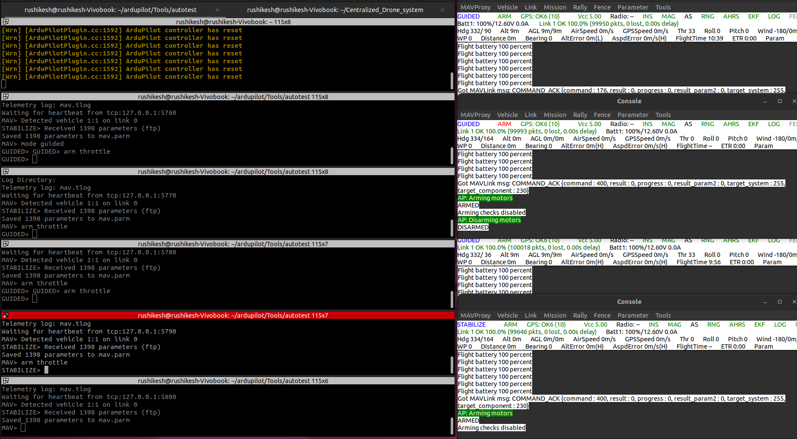

# 🚁 Centralized Deconfliction System for Drones

> A real-time UAV deconfliction and mission management system built with Flask and Flask-SocketIO

[](https://www.python.org/downloads/)
[](https://flask.palletsprojects.com/)
[](LICENSE)

---

## 🎥 Project Demonstrations
[!IMPORTANT] Watch the system in action! These videos demonstrate real-time deconfliction, multi-drone coordination, and the 3D visualization dashboard.

Video Link 1: ([System Integration & Real-time Flight](https://drive.google.com/file/d/1tUT_X_w1pVwQ_xz616rAD3vhMtxcMLYq/view))

Video Link 2: ([Conflict Detection & Multi-Drone Dashboard](https://drive.google.com/file/d/1D70UwxZkvkphCUw1X53-z8AvGhQfQyl8/view))

## 📋 Table of Contents

- [Overview](#-overview)
- [Key Features](#-key-features)
- [Architecture](#-architecture)
- [System Components](#-system-components)
- [API Reference](#-api-reference)
- [Installation](#-installation)
- [Quick Start](#-quick-start)
- [Screenshots](#-screenshots)
- [Development](#-development)
- [Contributing](#-contributing)
- [License](#-license)

---

## 🎯 Overview

This project provides a centralized control and deconfliction system for managing small fleets of drones. The system enables safe, coordinated multi-drone operations through real-time conflict detection, mission scheduling, and trajectory management.

### What It Does

- **Real-time Monitoring**: Collects and processes drone telemetry (position, velocity, battery, armed state)
- **Trajectory Management**: Records and serves historical and planned flight paths
- **Conflict Detection**: Prevents mission conflicts and detects real-time proximity issues
- **Mission Scheduling**: Validates and schedules drone missions with safety checks
- **Live Dashboard**: Interactive web interface with real-time visualization
- **Flexible Control**: Direct drone commands via REST API and WebSocket

---

## ✨ Key Features

| Feature | Description |
|---------|-------------|
| **Multi-Drone Support** | Manage multiple drones simultaneously with independent control |
| **Real-time Updates** | 2Hz WebSocket broadcasts for low-latency state updates |
| **Deconfliction Engine** | Configurable safety buffers and conflict prediction |
| **Mission Planning** | Schedule missions with automatic conflict validation |
| **Historical Playback** | Review past flights with detailed trajectory data |
| **Emergency Controls** | Immediate stop-all capability for critical situations |
| **Extensible Architecture** | Modular design supports hardware integration via MAVLink/DroneKit |

---

## 🏗️ Architecture

### High-Level Overview

```
┌───────────────────────────────────────────────────────────────┐
│                     CLIENT LAYER (Tier 1)                     │
│              Web Browsers & External API Clients              │
│                                                               │
│  ┌──────────────┐    ┌──────────────┐    ┌──────────────┐     │
│  │  Dashboard   │    │Visualization │    │   History    │     │
│  │  (HTTP/WS)   │    │ (WebSocket)  │    │   (HTTP)     │     │
│  └──────┬───────┘    └──────┬───────┘    └──────┬───────┘     │
│         │                   │                    │            │
│         └───────────────────┴────────────────────┘            │
│                            │                                  │
│             HTTP REST API + WebSocket (Port 5000)             │
│                            │                                  │
└────────────────────────────┼──────────────────────────────────┘
                             │
┌────────────────────────────┼──────────────────────────────────┐
│               APPLICATION LAYER (Tier 2)                      │
│                  Python Flask Backend                         │
│                            │                                  │
│  ┌─────────────────────────┴──────────────────────────┐       │
│  │         Flask + SocketIO Server Core               │       │
│  ├────────────────────────────────────────────────────┤       │
│  │  • Request Router (API endpoints & templates)      │       │
│  │  • WebSocket Manager (bidirectional events)        │       │
│  │  • Background Update Thread (2Hz broadcast)        │       │
│  │  • Mission Executor Thread (task scheduler)        │       │
│  └────┬──────────┬─────────────┬──────────────┬───────┘       │
│       │          │             │              │               │
│       ▼          ▼             ▼              ▼               │
│  ┌─────────┐ ┌────────┐  ┌─────────┐   ┌──────────┐           │
│  │  Drone  │ │Deconf. │  │ Mission │   │ Database │           │
│  │Controller│ │ Engine │  │Executor │   │  Module  │          │
│  └────┬────┘ └────────┘  └─────────┘   └──────────┘           │
│       │                                                       │
└───────┼───────────────────────────────────────────────────────┘
        │
        │ MAVLink 2.0 Protocol (UDP 14550-14553)
        │
┌───────┼───────────────────────────────────────────────────────┐
│   SIMULATION LAYER (Tier 3)                                   │
│   ArduPilot SITL + Gazebo Physics Engine                      │
│       │                                                       │
│       ▼                                                       │
│  ┌──────────────────────────────────────────┐                 │
│  │  ArduPilot SITL Instances (Autopilot)    │                 │
│  │  ┌──────┐  ┌──────┐  ┌──────┐  ┌──────┐  │                 │
│  │  │SITL  │  │SITL  │  │SITL  │  │SITL  │  │                 │
│  │  │I0    │  │I1    │  │I2    │  │I3    │  │                 │
│  │  │:14550│  │:14560│  │:14570│  │:14580│  │                 │
│  │  └───┬──┘  └───┬──┘  └───┬──┘  └───┬──┘  │                 │
│  └──────┼─────────┼─────────┼─────────┼─────┘                 │
│         └─────────┴─────────┴─────────┘                       │
│                       │                                       │
│         Gazebo JSON Protocol (TCP/UDP)                        │
│                       │                                       │
│            ┌──────────┴──────────┐                            │
│            │  Gazebo Simulator   │                            │
│            │  • multi_iris.sdf   │                            │
│            │  • Physics Engine   │                            │
│            │  • 4x Iris Models   │                            │
│            └─────────────────────┘                            │
└───────────────────────────────────────────────────────────────┘
```

### Data Flow
```
┌────────────┐
│   Client   │
│  Browser   │
└──────┬─────┘
       │ 1. HTTP GET /
       ▼
┌────────────────┐
│ Flask Router   │◄──────────┐
└───────┬────────┘           │
        │ 2. Render          │
        │    dashboard.html  │
        ▼                    │
┌────────────────┐           │
│  Client gets   │           │
│  HTML + JS     │           │
└───────┬────────┘           │
        │ 3. WebSocket       │
        │    Connect         │
        ▼                    │
┌────────────────┐           │
│ SocketIO       │           │
│ Manager        │           │
└───────┬────────┘           │
        │ 4. Subscribe       │
        │    to updates      │8. Emit drone_update
        ▼                    │    (2Hz broadcast) 
┌────────────────┐           │
│ Background     │           │
│ Update Thread  │───────────┘
└───────┬────────┘
        │ 5. Get states         
        ▼
┌────────────────┐
│ Drone          │
│ Controller     │
└───────┬────────┘
        │ 6. MAVLink request
        ▼
┌────────────────┐
│ ArduPilot SITL │
│ (Port 14550)   │
└───────┬────────┘
        └  7. Telemetry data
        
```

1. **State Updates**: Drone controller continuously updates internal state and records trajectory points
2. **Conflict Checking**: Background thread monitors drone positions and detects conflicts in real-time
3. **Broadcasting**: State changes are broadcast to all connected WebSocket clients at 2Hz
4. **Mission Validation**: Scheduled missions undergo deconfliction checks before execution
5. **Command Execution**: Control commands are processed immediately with state updates broadcast

---

## 💻 Technology Stack

### Core Technologies

| Layer | Component | Technology | Version | Purpose |
|-------|-----------|-----------|---------|---------|
| Backend | Web Framework | Flask | 2.0+ | HTTP server & REST API |
| Backend | Real-time Engine | Flask-SocketIO | 5.0+ | WebSocket communication |
| Backend | CORS Handler | Flask-CORS | 3.0+ | Cross-origin requests |
| Communication | Drone Protocol | PyMAVLink | 2.4+ | MAVLink 2.0 implementation |
| Computing | Array Processing | NumPy | 1.21+ | Matrix operations |
| Computing | Scientific Computing | SciPy | 1.7+ | Interpolation algorithms |
| Computing | Timezone Handling | pytz | 2021+ | UTC conversions |
| Simulation | Physics Engine | Gazebo | Harmonic/Garden | 3D physics simulation |
| Simulation | Autopilot | ArduPilot SITL | 4.x | Flight controller |
| Frontend | Interface | HTML5/CSS3/JS | - | Interactive dashboard |

### Communication Protocols

| Protocol | Port | Direction | Purpose |
|----------|------|-----------|---------|
| MAVLink 2.0 | UDP 14550-14553 | Bidirectional | Drone telemetry & commands |
| HTTP/1.1 | TCP 5000 | Request-Response | REST API endpoints |
| WebSocket | TCP 5000 | Full-Duplex | Real-time updates |
| Gazebo Transport | TCP/UDP 11345 | Bidirectional | Physics simulation |

---

## 🔧 System Components

### Core Modules

#### `app.py` - Main Server
The central Flask application that orchestrates all system components.

- Initializes Flask and SocketIO server
- Manages background update threads
- Exposes REST API endpoints
- Handles WebSocket event routing

#### `drone_controller.py` - Fleet Management
Abstraction layer for drone fleet operations.

**Key Methods:**
- `get_drone_status(drone_id)` - Retrieve individual drone state
- `get_all_status()` - Get status of all drones
- `get_trajectory(drone_id)` - Access trajectory buffer
- `arm_drone()`, `takeoff()`, `land()` - Flight control commands
- `goto_position(lat, lon, alt)` - Waypoint navigation
- `emergency_stop_all()` - Critical stop function

#### `deconfliction_engine.py` - Safety Core
Validates mission safety and prevents conflicts.

**Configuration:**
- Adjustable safety buffer distance
- Temporal and spatial conflict detection
- Multi-trajectory analysis

**Main Method:**
```python
check_mission_conflict(drone_id, waypoints, start_time, end_time)
# Returns: (is_safe: bool, conflicts: list)
```

#### `mission_executor.py` - Mission Lifecycle
Manages mission scheduling and execution state.

**Features:**
- Mission queuing and scheduling
- State tracking (scheduled → running → completed)
- Integration with deconfliction engine

#### `database.py` - Persistence Layer
Handles data storage and retrieval.

**Functions:**
- `init_db()` - Initialize database schema
- `create_mission()` - Persist mission data
- `get_active_missions()` - Retrieve running missions
- `get_drone_trajectory()` - Historical trajectory queries
- `get_future_trajectories()` - Planned flight paths

---

## 📡 API Reference

### REST Endpoints

#### Drone Status

```http
GET /api/drones
```
Returns current status for all drones in the fleet.

**Response:**
```json
{
  "success": true,
  "drones": [
    {
      "id": "drone_1",
      "position": {"lat": 12.34, "lon": 56.78, "alt": 100},
      "velocity": {"vx": 5.0, "vy": 0.0, "vz": 0.0},
      "battery": 87.5,
      "armed": true
    }
  ]
}
```

#### Mission Management

```http
POST /api/schedule
Content-Type: application/json

{
  "drone_id": "drone_1",
  "waypoints": [
    {"lat": 12.34, "lon": 56.78, "alt": 100},
    {"lat": 12.35, "lon": 56.79, "alt": 120}
  ],
  "start_time": "2024-01-01T10:00:00Z",
  "end_time": "2024-01-01T10:30:00Z"
}
```

```http
GET /api/missions
```
Returns all active missions.

#### Drone Control

```http
POST /api/control/<drone_id>
Content-Type: application/json

{
  "command": "takeoff",
  "altitude": 50
}
```

**Available Commands:**
- `arm` / `disarm` - Arm/disarm motors
- `takeoff` - Takeoff to specified altitude
- `land` - Land at current position
- `rtl` - Return to launch point
- `goto` - Navigate to coordinates
- `stop` - Stop current mission

```http
POST /api/emergency
```
Emergency stop for all drones.

#### Trajectory Data

```http
GET /api/trajectory/<drone_id>
```
Returns recent trajectory points.

```http
GET /api/history/trajectory/<drone_id>?start_time=2024-01-01T00:00:00Z&end_time=2024-01-01T23:59:59Z
```
Returns filtered historical trajectory.

```http
GET /api/historical/trajectories
```
Returns all historical trajectories (past 1 hour).

```http
GET /api/future/trajectories
```
Returns planned/scheduled trajectories.

#### Analytics

```http
GET /api/history/statistics
```
Returns aggregated flight statistics.

**Response:**
```json
{
  "success": true,
  "total_distance": 15432.5,
  "total_flight_time": 7200,
  "per_drone": {
    "drone_1": {
      "distance": 5123.4,
      "flight_time": 2400,
      "missions_completed": 5
    }
  }
}
```

```http
GET /api/history/conflicts
```
Returns conflict event history.

---

### WebSocket Events

#### Client → Server

| Event | Payload | Description |
|-------|---------|-------------|
| `request_update` | `{}` | Request immediate state snapshot |
| `request_historical_playback` | `{drone_id, start_time?, end_time?}` | Request trajectory playback |
| `request_historical_state` | `{time}` | Request state at specific time |
| `control_drone` | `{drone_id, command, ...}` | Execute drone command |

#### Server → Client

| Event | Frequency | Description |
|-------|-----------|-------------|
| `connected` | Once | Initial connection acknowledgment |
| `drone_update` | 2Hz | Periodic state updates for all drones |
| `conflict_alert` | On Event | Immediate conflict notification |
| `historical_trajectory` | On Request | Trajectory data response |
| `control_response` | On Command | Command execution result |

**Example `drone_update` Event:**
```json
{
  "timestamp": "2024-01-01T10:30:45Z",
  "drones": [...],
  "conflicts": [
    {
      "drone_1": "drone_1",
      "drone_2": "drone_2",
      "distance": 8.5,
      "severity": "warning"
    }
  ]
}
```

---

## 🛠️ Installation

### Prerequisites

| Requirement | Version | Purpose |
|-------------|---------|---------|
| Python | 3.8+ | Runtime environment |
| Gazebo | Harmonic/Garden | Physics simulation |
| ArduPilot SITL | Latest | Flight controller simulation |
| Operating System | Ubuntu 22.04 (recommended) | Gazebo compatibility |

### Environment Setup

1. **Create Virtual Environment**

```bash
python -m venv venv
source venv/bin/activate  # On Windows: venv\Scripts\activate
```

2. **Install Python Dependencies**

Create `requirements.txt`:
```text
flask>=2.0.0
flask-socketio>=5.0.0
flask-cors>=3.0.0
pymavlink>=2.4.0
numpy>=1.21.0
scipy>=1.7.0
pytz>=2021.3
```

Install:
```bash
pip install -r requirements.txt
```

3. **Verify Gazebo Installation**

```bash
gz sim --version
```

4. **Configure ArduPilot SITL**

Ensure ArduPilot is installed and the Gazebo plugin is configured. Refer to [ArduPilot SITL documentation](https://ardupilot.org/dev/docs/sitl-simulator-software-in-the-loop.html).

---

## 🚀 Quick Start

### Step 1: Launch Gazebo Simulation

Start the multi-drone world:

```bash
gz sim -v4 -r multi_iris.sdf
```

This launches the physics simulation with multiple Iris quadcopter models.

### Step 2: Start ArduPilot SITL Instances

Open a separate terminal for each drone (I0 through I3):

```bash
# Terminal 1 - Drone 1
./sim_vehicle.py -v ArduCopter -f gazebo-iris --model JSON --console -I0

# Terminal 2 - Drone 2
./sim_vehicle.py -v ArduCopter -f gazebo-iris --model JSON --console -I1

# Terminal 3 - Drone 3
./sim_vehicle.py -v ArduCopter -f gazebo-iris --model JSON --console -I2

# Terminal 4 - Drone 4
./sim_vehicle.py -v ArduCopter -f gazebo-iris --model JSON --console -I3
```

Wait for each instance to display: **"APM: ArduCopter V4.x.x"**

### Step 3: Launch Deconfliction Backend

In a new terminal:

```bash
python main_integration.py
```

### Step 4: Access Web Interface

Open your browser and navigate to:

```
http://localhost:5000
```

**Available Pages:**
- `/` - Main dashboard
- `/visualization` - 3D flight path visualization
- `/history/<drone_id>` - Historical flight data

---

## 📸 Screenshots

### Dashboard Interface


*Real-time monitoring with live status indicators, mission queue, and conflict alerts*

### 3D Visualization


*Interactive 3D map showing drone trajectories, waypoints, and conflict zones*

### Historical Analysis


*Comprehensive flight history with distance, duration, and altitude analytics*



*Comparative performance metrics and conflict incident logging*

### Simulation Environment


*Gazebo physics simulation with multi-drone configuration*

### ArduPilot SITL


*ArduPilot SITL instances providing MAVLink communication*

---

## 🔨 Development

### Project Structure

```
centralized-deconfliction-system/
├── app.py                      # Main Flask application
├── drone_controller.py         # Drone fleet management
├── deconfliction_engine.py     # Conflict detection logic
├── mission_executor.py         # Mission scheduling
├── database.py                 # Data persistence
├── main_integration.py         # Integration entry point
├── requirements.txt            # Python dependencies
├── templates/                  # HTML templates
│   ├── dashboard.html
│   ├── visualization.html
│   └── history.html
├── static/                     # Frontend assets
│   ├── js/
│   └── css/
└── assets/                     # Documentation images
```

### Testing

**Unit Tests** (TODO):
```bash
pytest tests/unit/
```

**Integration Tests** (TODO):
```bash
pytest tests/integration/
```

### Configuration

Key configuration parameters in `app.py`:

```python
UPDATE_INTERVAL = 0.5  # 2Hz update rate
SAFETY_BUFFER = 10.0   # meters
MAX_DRONES = 10
```

---

## 🗺️ Roadmap

### High Priority

- [ ] Persistent database integration (PostgreSQL/TimescaleDB)
- [ ] Unit and integration test suite
- [ ] Authentication and authorization system
- [ ] Docker containerization with docker-compose
- [ ] OpenAPI/Swagger specification

### Medium Priority

- [ ] Role-based access control (RBAC)
- [ ] Advanced conflict resolution algorithms
- [ ] Mission replay and simulation mode
- [ ] Multi-region deployment support
- [ ] Performance monitoring and logging

### Future Enhancements

- [ ] Machine learning-based trajectory prediction
- [ ] Weather integration and wind modeling
- [ ] Battery optimization algorithms
- [ ] Mobile application (iOS/Android)
- [ ] Multi-user collaborative mission planning

---

## 🤝 Contributing

Contributions are welcome! Please follow these guidelines:

### Workflow

1. **Fork** the repository
2. **Create** a feature branch (`git checkout -b feature/amazing-feature`)
3. **Commit** your changes (`git commit -m 'Add amazing feature'`)
4. **Push** to the branch (`git push origin feature/amazing-feature`)
5. **Open** a Pull Request

### Code Standards

- Follow PEP 8 style guidelines
- Add docstrings to all functions and classes
- Include unit tests for new features
- Update documentation as needed

### Testing Requirements

All PRs must include:
- Unit tests with >80% coverage
- Integration tests for API endpoints
- Documentation updates

---

## ⚠️ Security Notice

**This system does NOT include authentication by default.**

- Do not expose to public internet without implementing proper authentication
- Use TLS/SSL for production deployments
- Implement rate limiting on API endpoints
- Regularly update dependencies for security patches

---

## 📄 License

This project is licensed under the MIT License - see the [LICENSE](LICENSE) file for details.

---

## 👥 Authors & Contact

- **Repository Owner**: [rushikeshpole](https://github.com/rushikeshpole)
- **Issues**: [GitHub Issues](https://github.com/rushikeshpole/centralized-deconfliction-system/issues)

### Support

For questions or support:
1. Check existing [GitHub Issues](https://github.com/rushikeshpole/centralized-deconfliction-system/issues)
2. Open a new issue with detailed description
3. Tag appropriately (`bug`, `feature`, `question`)

---

## 🙏 Acknowledgments

- ArduPilot Community for SITL support
- Gazebo Team for physics simulation
- Flask and SocketIO maintainers

---

<div align="center">

**Made with ❤️ for safer drone operations**

[⬆ Back to Top](#-centralized-deconfliction-system-for-drones)

</div>
